"# Container-Migration-project-from-VM-EC2-to-Containers" 

Migration to the Сloud with containerization. Part 1 -Docker & Docker Compose

Until now, you have been using VMs (AWS EC2) in Amazon Virtual Private Cloud (AWS VPC) to deploy your web solutions,and it works well in many cases. You have learned how easy to spin up and confi gure a new EC2 manually or with such toolsas Terraform and Ansible to automate provisioning and confi guration. You have also deployed two different websites onthe same VM; this approach is scalable, but to some extent; imagine what if you need to deploy many small applications (itcan be web front-end, web-backend, processing jobs, monitoring, logging solutions, etc.) and some of the applications willrequire various OS and runtimes of different versions and confl icting dependencies - in such case you would need to spinup serves for each group of applications with the exact OS/runtime/dependencies requirements. When it scales out totens/hundreds and even thousands of applications (e.g., when we talk of microservice architecture), this approachbecomes very tedious and challenging to maintain.

In this project, we will learn how to solve this problem and begin to practice the technology that revolutionized applicationdistribution and deployment back in 2013! We are talking of Containers and imply Docker. Even though there are other application containerization technologies, Docker is the standard and the default choice for shipping your app in acontainer!


Install Docker and prepare for migration to the Cloud
First, we need to install Docker Engine, which is a client-server application that contains:
A server with a long-running daemon process `dockerd`.
APIs that specify interfaces that programs can use to talk to and instruct the Docker daemon.
A command-line interface (CLI) client `docker`.


Before we proceed further, let us understand why we even need to move from VM to Docker.
As you have already learned - unlike a VM, Docker allocated not the whole guest OS for your application, but only isolatedminimal part of it - this isolated container has all that your application needs and at the same time is lighter, faster, and can be shipped as a Docker image to multiple physical or virtual environments, as long as this environment can run Dockerengine. This approach also solves the environment incompatibility issue. It is a well-known problem when a developer sends his application to you, you try to deploy it, deployment fails, and the developer replies,
"- It works on my machine!"
.With Docker - if the application is shipped as a container, it has its own environment isolated from the rest of the world,and it will always work the same way on any server that has Docker engine.

`IT WORKS ON MY MACHINE`
Now, when we understand the benefi ts we can get by using Docker containerization, let us learn what needs to be done tomigrate to Docker. Read
this excellent article for some insight
.
As a part of this project, you will use a CI tool that is already well-known by you
Jenkins
- for Continous Integration (CI). So,when it is time to write
Jenkinsfile
, update your Terraform code to spin up an EC2 instance for Jenkins and run Ansibleto install & confi gure it.
To begin our migration project from VM based workload, we need to implement a
Proof of Concept (POC)
. In many cases,it is good to start with a small-scale project with minimal functionality to prove that technology can fulfi ll specifi crequirements. So, this project will be a precursor before you can move on to deploy enterprise-grade microservicesolutions with Docker. And so, Project 21 through to 30 will gradually introduce concepts and technologies as we movefrom POC onto enterprise level deployments.
You can start with your own workstation or spin up an EC2 instance to install Docker engine that will host your Docker containers.

Remember our Tooling website? It is a PHP-based web solution backed by a MySQL database - all technologies you arealready familiar with and which you shall be comfortable using by now.
So, let us migrate the Tooling Web Application from a VM-based solution into a containerized one.

# Container Orchestration with Docker Compose
###   MySQL in container
Let us start assembling our application from the Database layer - we will use a pre-built MySQL database container,confi gure it, and make sure it is ready to receive requests from our PHP application.

Step 1: Pull MySQL Docker Image from Docker Hub Registry
Start by pulling the appropriate Docker image for MySQL. You can download a specific version or opt for the latest release,as seen in the following command:

```bash
docker pull mysql/mysql-server:latest
```
List the images to check that you have downloaded them successfully:
```bash
docker images ls
```

Step 2: Deploy the MySQL Container to your Docker Engine
1.Once you have the image, move on to deploying a new MySQL container with:

```bash 
docker run --name <container_name> -e MYSQL_ROOT_PASSWORD=<my-secret-pw> -d mysql/mysql-server:latest
```

Replace <container_name> with the name of your choice. If you do not provide a name, Docker will generate arandom one
The -d option instructs Docker to run the container as a service in the background
Replace <my-secret-pw> with your chosen password
In the command above, we used the latest version tag. This tag may differ according to the image you downloaded

2.Then, check to see if the MySQL container is running: Assuming the container name specified is mysql_server

```bash 
docker ps
```


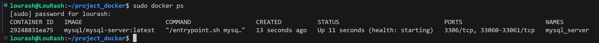

You should see the newly created container listed in the output. It includes container details, one being the status of thisvirtual environment. The status changes from health: starting to healthy, once the setup is complete.
 
 tep 3: Connecting to the MySQL Docker Container
We can either connect directly to the container running the MySQL server or use a second container as a MySQL client.Let us see what the fi rst option looks like.
Approach 1

Connecting directly to the container running the MySQL server:

```bash
docker exec -it mysql_server mysql -uroot -p
```


Provide the root password when prompted. With that, you have connected the MySQL client to the server.
Finally, change the server root password to protect your database.

Approach 2
First, create a network:

```bash
docker network create --subnet=172.18.0.0/24 tooling_app_network
```

Creating a custom network is not necessary because even if we do not create a network, Docker will use the defaultnetwork for all the containers you run. By default, the network we created above is of `DRIVER Bridge`. So, also, it is the default network. You can verify this by running the
docker network ls
command.
But there are use cases where this is necessary. For example, if there is a requirement to control the
cidr
range of thecontainers running the entire application stack. This will be an ideal situation to create a network and specify the
--subnet

For clarity's sake, we will create a network with a subnet dedicated for our project and use it for both MySQL and theapplication so that they can connect.
Run the MySQL Server container using the created network.
First, let us create an environment variable to store the root password:

`export MYSQL_PW=<root-secret-password>`

Then, pull the image and run the container, all in one command like below:

```bash
docker run --network tooling_app_network -h mysqlserverhost --name=mysql-server -e MYSQL_ROOT_PASSWORD=$MYSQL_PW  -d mysql/mysql-server:latest 
```


Flags used

*   -d runs the container in detached mode
*   --network connects a container to a network
*   -h specifies a hostname

If the image is not found locally, it will be downloaded from the registry.

Verify the container is running:

```bash
docker ps -a
```

`CONTAINER ID   IMAGE                       COMMAND                   CREATED          STATUS                     PORTS                                                                                      NAMES
d642bca506a2   mysql/mysql-server:latest   "/entrypoint.sh mysq…"    51 seconds ago   Up 50 seconds (healthy)    3306/tcp, 33060-33061/tcp       `


As you already know, it is best practice not to connect to the MySQL server remotely using the root user. Therefore, we will create an SQL script that will create a user we can use to connect remotely.

Create a file and name it create_user.sql and add the below code in the file:

```bash
CREATE USER '<user>'@'%' IDENTIFIED BY '<client-secret-password>';GRANT ALL PRIVILEGES ON * . * TO '<user>'@'%';
```

Run the script:

```bash
docker exec -i mysql-server mysql -uroot -p$MYSQL_PW < ./create_user.sql
```

If you see a warning like below, it is acceptable to ignore:

`lourash@LouRash:~/project_docker$ docker exec -i mysql-server mysql -uroot -p$MYSQL_PW < ./create_user.sql
mysql: [Warning] Using a password on the command line interface can be insecure.`


#   Container Registry and Image Push
Connecting to the MySQL server from a second container running the MySQL client utility

The good thing about this approach is that you do not have to install any client tool on your laptop, and you do not need toconnect directly to the container running the MySQL server.

Run the MySQL Client Container:

```bash
docker run --network tooling_app_network --name mysql-client -it --rm mysql mysql -h mysqlserverhost -u lourash -p
```

Flags used:
--name gives the container a name
-it runs in interactive mode and Allocate a pseudo-TTY
--rm automatically removes the container when it exits
--network connects a container to a network
-h a MySQL flag specifying the MySQL server Container hostname
-u user created from the SQL script
-p password specified for the user created from the SQL script

##  Prepare database schema

Now you need to prepare a database schema so that the Tooling application can connect to it.
1.  Clone the Tooling-app repository 

```bash
git clone https://github.com/darey-devops/tooling.git
```

2.  On your terminal, export the location of the SQL file

```bash
export tooling_db_schema=~/tooling/html/tooling_db_schema.sql
```

You can find the tooling_db_schema.sql in the html folder of cloned repo.

3.  Use the SQL script to create the database and prepare the schema. With the docker exec command, you can execute a command in a running container

```bash
docker exec -i mysql-server mysql -uroot -p$MYSQL_PW < $tooling_db_schema
```

4.  Update the db_conn.php file with connection details to the database

```bash
$servername = "mysqlserverhost";
$username = "<user>";
$password = "<client-secret-password>";
$dbname = "toolingdb";
```

5.  Run the Tooling App
Containerization of an application starts with creation of a file with a special name - 'Dockerfile' (without any extensions).This can be considered as a 'recipe' or 'instruction' that tells Docker how to pack your application into a container. In this project, you will build your container from a pre-created Dockerfile, but as a DevOps, you must also be able to write Dockerfiles.

You can watch this [video](https://www.youtube.com/watch?v=hnxI-K10auY) to get an idea how to create your Dockerfile and build a container from it.
And on this [page](https://docs.docker.com/develop/develop-images/dockerfile_best-practices/), you can find official Docker best practices for writing Dockerfiles.

So, let us containerize our Tooling application; here is the plan:

*   Make sure you have checked out your Tooling repo to your machine with Docker engine
*   First, we need to build the Docker image the tooling app will use. The Tooling repo you cloned above has a `Dockerfile`
for this purpose. Explore it and make sure you understand the code inside it.
*   Run `docker build` command
*   Launch the container with `docker run`
*   Try to access your application via port exposed from a container

Let us begin:

Ensure you are inside the folder that has the Dockerfile and build your container:

```bash
docker build -t tooling:0.0.1 .
```


In the above command, we specify a parameter -t, so that the image can be tagged tooling"0.0.1 - Also, you have to notice the . at the end. This is important as that tells Docker to locate the Dockerfile in the current directory you are running the command. Otherwise, you would need to specify the absolute path to the Dockerfile .

6.  Run the container:
```bash
docker run --network tooling_app_network -p 8085:80 -it tooling:0.0.1
```
Let us observe those flags in the command.
We need to specify the --network flag so that both the Tooling app and the database can easily connect on thesame virtual network we created earlier.
The -p flag is used to map the container port with the host port. Within the container,apache is the webserver running and, by default, it listens on port 80. You can confirm this with the CMD ["start-apache"] section of the Dockerfile. But we cannot directly use port 80 on our host machine because it is already in use. The workaround is to use another port that is not used by the host machine. In our case, port 8085 is free, so we can map that to port 80 running in the container.

If everything works, you can open the browser and type
http://localhost:8085
You will see the login page.

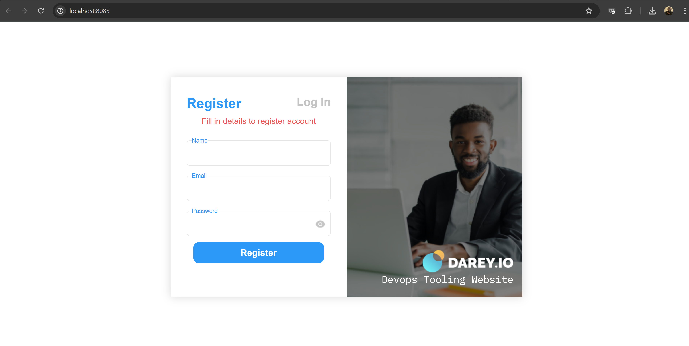
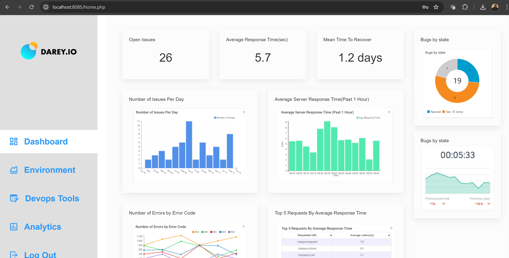

The default email is `test@gmail.com`, the password is `12345` or you can check users' credentials stored in the`toolingdb.user` table.

Container Orchestration with Kubernetes
Practice Task №1 - Implement a POC to migrate the PHP-Todo app into a containerized application

Download php-todo repository from [here](https://github.com/darey-devops/php-todo)

**Part 1**

1.  Write a Dockerfile for the TODO app
2.  Run both database and app on your laptop Docker Engine
3.  Access the application from the browse

### Solution

clone the repo into the local machine

run 
```bash
git clone https://github.com/darey-devops/php-todo

```

```bash
cd php-todo
```

##  PART 1 : 

Write a Dockerfile for the TODO app

```bash
FROM php:7-apache
MAINTAINER Dare dare@darey.io

ENV MYSQL_IP=$MYSQL_IP
ENV MYSQL_USER=$MYSQL_USER
ENV MYSQL_PASS=$MYSQL_PASS
ENV MYSQL_DBNAME=$MYSQL_DBNAME

RUN docker-php-ext-install mysqli
RUN echo "ServerName localhost" >> /etc/apache2/apache2.conf
RUN curl -sS https://getcomposer.org/installer | php -- --install-dir=/usr/local/bin --filename=composer
COPY apache-config.conf /etc/apache2/sites-available/000-default.conf
COPY start-apache /usr/local/bin
RUN a2enmod rewrite

# Copy application source
COPY html /var/www
RUN chown -R www-data:www-data /var/www

CMD ["start-apache"]

```
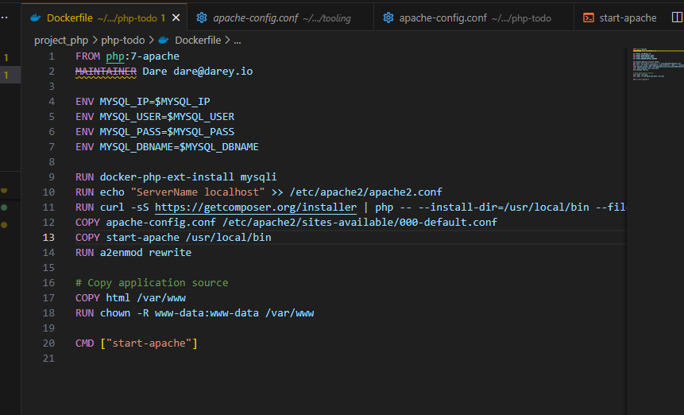


Let's break down the provided Dockerfile step by step to understand what each line does:

```Dockerfile
FROM php:7-apache
```
- **Description**: This line specifies the base image for the Docker container. It uses the official PHP image with Apache web server support.

```Dockerfile
MAINTAINER Dare dare@darey.io
```
- **Description**: This line sets the maintainer's name and email address for the Docker image. It's used for informational purposes to indicate who maintains the image.

```Dockerfile
ENV MYSQL_IP=$MYSQL_IP
ENV MYSQL_USER=$MYSQL_USER
ENV MYSQL_PASS=$MYSQL_PASS
ENV MYSQL_DBNAME=$MYSQL_DBNAME
```
- **Description**: These lines define environment variables within the Docker image. They set the values of `MYSQL_IP`, `MYSQL_USER`, `MYSQL_PASS`, and `MYSQL_DBNAME` to the corresponding environment variables passed during the Docker build or run. These variables will be available within the container for configuring MySQL connections.

```Dockerfile
RUN docker-php-ext-install mysqli
```
- **Description**: This line installs the MySQLi extension for PHP, which is necessary for PHP applications to communicate with MySQL databases.

```Dockerfile
RUN echo "ServerName localhost" >> /etc/apache2/apache2.conf
```
- **Description**: This line adds a configuration line to Apache's configuration file to set the server name to "localhost". This can help prevent warnings about the server name not being set.

```Dockerfile
RUN curl -sS https://getcomposer.org/installer | php -- --install-dir=/usr/local/bin --filename=composer
```
- **Description**: This line downloads and installs Composer, a dependency manager for PHP, and places the `composer` executable in `/usr/local/bin` so it can be used globally.

```Dockerfile
COPY apache-config.conf /etc/apache2/sites-available/000-default.conf
```
- **Description**: This line copies a custom Apache configuration file from the local machine (`apache-config.conf`) into the container's Apache sites-available directory, replacing the default configuration.

```Dockerfile
COPY start-apache /usr/local/bin
```
- **Description**: This line copies a script named `start-apache` from the local machine into the container's `/usr/local/bin` directory. This script will be used to start the Apache server.

```Dockerfile
RUN a2enmod rewrite
```
- **Description**: This line enables the Apache rewrite module, which is often used for URL rewriting and is necessary for many web applications.

```Dockerfile
# Copy application source
COPY html /var/www
```
- **Description**: This line copies the content of the `html` directory from the local machine to the `/var/www` directory in the container. This is where the web application's files are stored.

```Dockerfile
RUN chown -R www-data:www-data /var/www
```
- **Description**: This line changes the ownership of the `/var/www` directory and its contents to the `www-data` user and group, which is the default user and group under which Apache runs. This ensures that Apache has the necessary permissions to access and serve the files.

```Dockerfile
CMD ["start-apache"]
```
- **Description**: This line sets the command that will be run when the container starts. In this case, it runs the `start-apache` script, which is expected to start the Apache web server.

Overall, this Dockerfile sets up a PHP and Apache environment, installs necessary dependencies, configures Apache, copies the application files, and ensures the web server is started when the container runs.


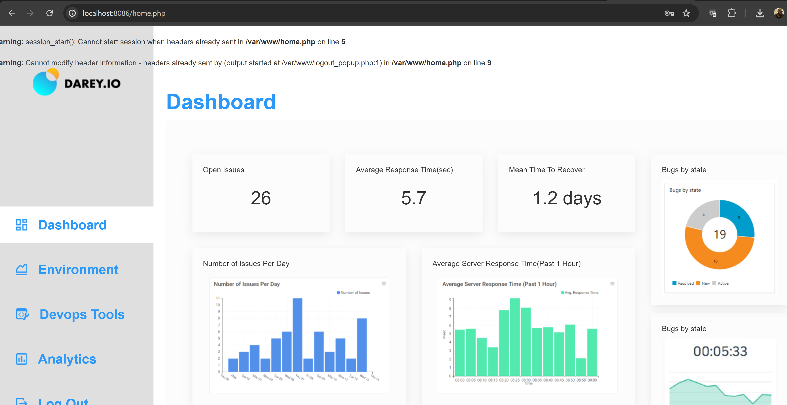


##  PART 2

1.  Create an account in Docker Hub
2.  Create a new Docker Hub repository
3.  Push the docker images from your PC to the repository


### 1. Create an Account in Docker Hub

1. **Visit Docker Hub**: Go to [Docker Hub](https://hub.docker.com/).
2. **Sign Up**: Click on "Sign Up" and fill in the required information (username, email, and password). Complete the registration process by verifying your email if required.

### 2. Create a New Docker Hub Repository

1. **Log In**: Log in to your Docker Hub account.
2. **Create Repository**:
   - Click on your username at the top right corner and select "Repositories".
   - Click on the "Create Repository" button.
   - Fill in the repository name, description, and choose visibility (public or private). Click "Create".

### 3. Push Docker Images from Your PC to the Repository

#### Prerequisites:

- Make sure Docker is installed and running on your PC.
- Ensure you are logged in to Docker Hub from your terminal.

##### Step-by-Step Guide:

1. **Log In to Docker Hub**:
   ```bash
   docker login
   ```
   - Enter your Docker Hub username and password when prompted.

   

2. **Tag Your Docker Image**:
   - First, list your existing Docker images to find the image ID or name.
     ```bash
     docker images
     ```
   - Tag your Docker image to prepare it for pushing to Docker Hub. Use the following format:
     ```bash
     docker tag <image_name>:<tag> <dockerhub_username>/<repository_name>:<tag>
     ```
     For example:
     ```bash
     docker tag my-app:latest myusername/my-repo:latest
     ```

3. **Push the Docker Image**:
   - Use the `docker push` command to push your tagged image to the Docker Hub repository.
     ```bash
     docker push <dockerhub_username>/<repository_name>:<tag>
     ```
     For example:
     ```bash
     docker push myusername/my-repo:latest
     ```

### Example:

Here's a complete example assuming you have a Docker image named `php-todo` and your Docker Hub username is `myusername` and repository name is `php-todo-repo`.

1. **Tag the Docker Image**:
   ```bash
   docker tag php-todo:latest myusername/php-todo-repo:latest
   ```

2. **Push the Docker Image**:
   ```bash
   docker push myusername/php-todo-repo:latest
   ```

### Verification:

- Go to Docker Hub and navigate to your repository.
- You should see the newly pushed image listed there.

By following these steps, you can successfully create a Docker Hub account, set up a new repository, and push your Docker images from your local machine to Docker Hub.

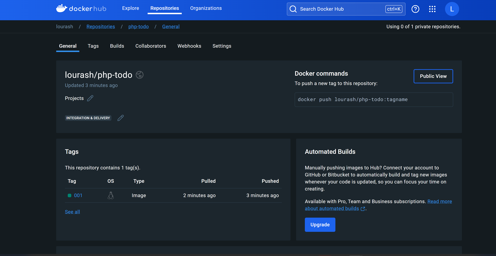


Part 3
1.  Write a Jenkinsfile that will simulate a Docker Build and a Docker Push to the registry
2.  Connect your repo to Jenkins
3.  Create a multi-branch pipeline
4.  Simulate a CI pipeline from a feature and master branch using previously created Jenkinsfile
5.  Ensure that the tagged images from your Jenkinsfile have a prefix that suggests which branch the image was pushed from. For example,feature-0.0.1.
6.  Verify that the images pushed from the CI can be found at the registry.


# Jenkins Multibranch Pipeline for Docker Build and Push

## Prerequisites

1. **Jenkins** - Ensure Jenkins is installed and running.
2. **GitHub Repository** - Ensure you have a GitHub repository with the necessary code and Jenkinsfile.
3. **Docker Hub Account** - Ensure you have a Docker Hub account and credentials.
4. **Docker Installed** - Ensure Docker is installed on your Jenkins instance.

## Step-by-Step Guide

### 1. Write a Jenkinsfile

Create a Jenkinsfile in your GitHub repository that will build and push Docker images. Below is an example Jenkinsfile:

```groovy
pipeline {
    agent any

    environment {
        DOCKER_HUB_CREDENTIALS_ID = 'Dockerhub' // Replace with your actual credentials ID
        DOCKER_HUB_USERNAME = 'lourash'
        REPO_NAME = 'php-todo'
    }

    stages {
        stage('Checkout') {
            steps {
                script {
                    git branch: env.BRANCH_NAME, url: 'https://github.com/lourash-hub/php-todo.git'
                }
            }
        }
        stage('Build Docker Image') {
            steps {
                script {
                    def branchName = env.BRANCH_NAME
                    def version = '001' // Define your version here or dynamically obtain it

                    // Define image tag with branch prefix
                    def imageTag = "${DOCKER_HUB_USERNAME}/${REPO_NAME}:${branchName}-${version}"

                    // Build Docker image
                    sh "docker build -t ${imageTag} ."
                }
            }
        }
        stage('Push Docker Image') {
            steps {
                script {
                    def branchName = env.BRANCH_NAME
                    def version = '001'
                    def imageTag = "${DOCKER_HUB_USERNAME}/${REPO_NAME}:${branchName}-${version}"
                    withCredentials([usernamePassword(credentialsId: env.DOCKER_HUB_CREDENTIALS_ID, passwordVariable: 'DOCKER_HUB_PASSWORD', usernameVariable: 'DOCKER_HUB_USERNAME')]) {
                        sh "echo ${DOCKER_HUB_PASSWORD} | docker login -u ${DOCKER_HUB_USERNAME} --password-stdin"
                    }
                    sh "docker push ${imageTag}"
                }
            }
        }
    }
    post {
        always {
            // Cleanup Docker environment
            sh 'docker system prune -f'
        }
    }
}
```

### 2. Connect Your Repo to Jenkins

To connect your GitHub repository to Jenkins:

1. **Go to Jenkins Dashboard**:
    - Open your Jenkins instance in a web browser and navigate to the Jenkins Dashboard.

2. **Create a New Item**:
    - Click on `New Item` in the left-hand menu.
    - Enter a name for your pipeline (e.g., `php-todo-multibranch-pipeline`).
    - Select `Multibranch Pipeline` as the project type.
    - Click `OK`.

### 3. Create a Multibranch Pipeline

To create a multibranch pipeline in Jenkins:

1. **Configure Pipeline with GitHub Repository**:
    - In the configuration page, under `Branch Sources`, click `Add Source` and choose `GitHub`.

2. **Configure GitHub Source**:
    - **Credentials**: Add your GitHub credentials if not already added. Choose the appropriate credentials from the list.
    - **Owner**: Enter the GitHub repository owner (in your case, it would be `lourash-hub`).
    - **Repository**: Enter the repository name (`php-todo`).

3. **Build Configuration**:
    - Under `Build Configuration`, choose `by Jenkinsfile`.

4. **Scan Repository Triggers**:
    - Set up the trigger to automatically scan the repository for changes.
    - Check the option `Periodically if not otherwise run` and set the interval (e.g., `1 hour`).

5. **Save the Configuration**:
    - Click `Save` to save your Multibranch Pipeline configuration.

### 4. Simulate a CI Pipeline

To simulate a CI pipeline from feature and master branches:

1. **Create Branches**:
    - Ensure you have both `feature` and `master` branches in your GitHub repository.

2. **Push Code to Branches**:
    - Push the `Jenkinsfile` to both `feature` and `master` branches.

3. **Jenkins Pipeline Execution**:
    - Jenkins will automatically discover and run the pipeline for each branch based on the Jenkinsfile.

### 5. Tag Images with Branch Prefix

The provided Jenkinsfile already handles tagging the images with the branch name and build number:

```groovy
def imageName = "${DOCKER_HUB_USERNAME}/${REPO_NAME}:${env.BRANCH_NAME}-${BUILD_NUMBER}"
```

This will result in tags like `feature-001` or `master-001`.

### 6. Verify Images in Docker Hub

To verify that the images pushed from the CI can be found at the registry:

1. **Log in to Docker Hub**:
    - Open Docker Hub in your web browser and log in with your credentials.

2. **Navigate to Your Repository**:
    - Go to `https://hub.docker.com/repository/docker/lourash/php-todo` to see the images pushed from Jenkins.

3. **Check the Tags**:
    - Ensure the images have tags corresponding to the branch names and build numbers (e.g., `feature-001`, `master-001`).

### Troubleshooting Docker Issues on Red Hat

If you encounter issues with Docker and Podman, follow these steps:

1. **Uninstall Podman and its associated packages**:
    ```bash
    sudo yum remove -y podman podman-docker
    ```

2. **Add the Docker repository**:
    ```bash
    sudo yum-config-manager --add-repo https://download.docker.com/linux/centos/docker-ce.repo
    ```

3. **Install Docker**:
    ```bash
    sudo yum install -y docker-ce docker-ce-cli containerd.io
    ```

4. **Start and enable Docker service**:
    ```bash
    sudo systemctl start docker
    sudo systemctl enable docker
    ```

5. **Add Jenkins user to Docker group**:
    ```bash
    sudo usermod -aG docker jenkins
    ```

6. **Restart Jenkins and Docker services**:
    ```bash
    sudo systemctl restart jenkins
    sudo systemctl restart docker
    ```


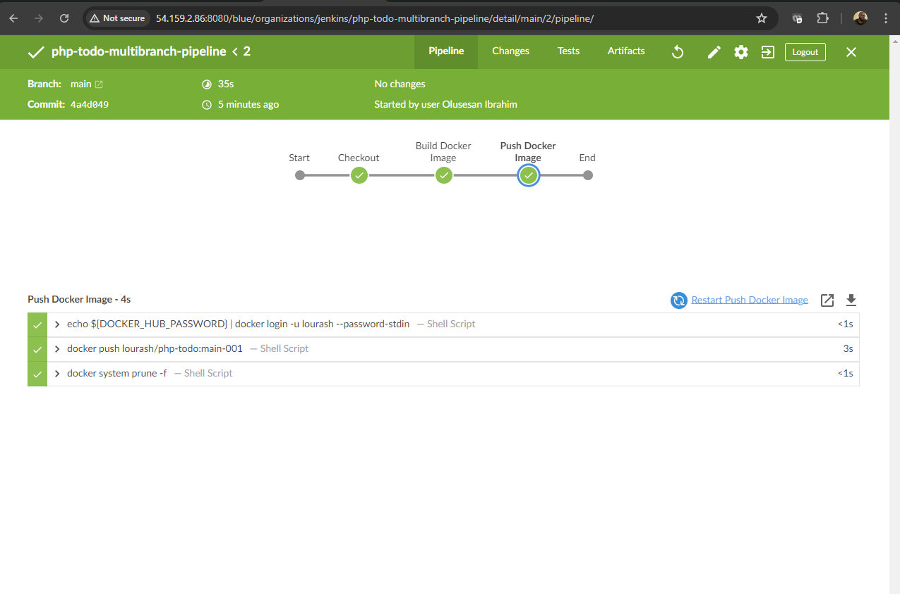
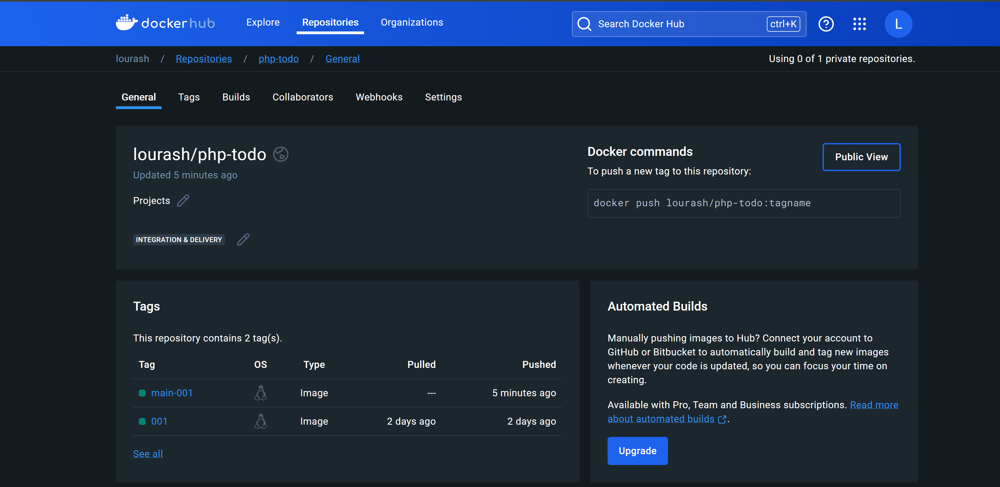
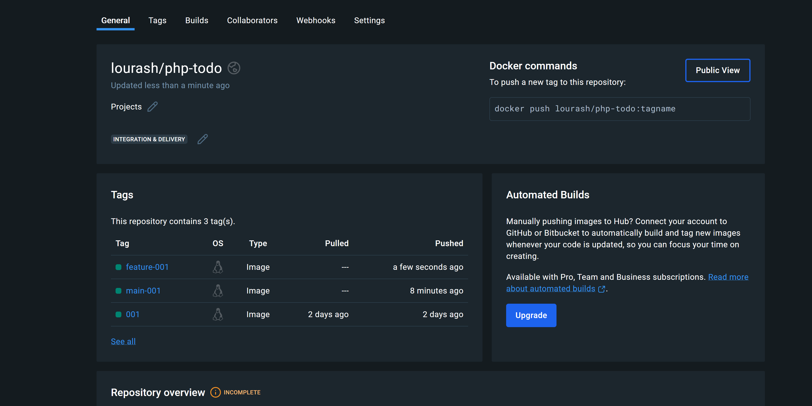


#   Deployment with Docker Compose
All we have done until now required quite a lot of effort to create an image and launch an application inside it. We should not have to always run Docker commands on the terminal to get our applications up and running. There are solutions that make it easy to write declarative code in YAML, and get all the applications and dependencies up and running with minimal effort by launching a single command.
In this section, we will refactor the Tooling app POC so that we can leverage the power of Docker Compose.
1. First, install Docker Compose on your workstation
2.  Create a file, name it tooling.yaml
3.  Begin to write the Docker Compose definitions with YAML syntax. The YAML file is used for defining services,networks, and volumes:

```bash
version: "3.9"
services:
  tooling_frontend:
    build: .
    ports:
      - "5000:80"
    volumes:
      - tooling_frontend:/var/www/html
```

The YAML file has declarative fi elds, and it is vital to understand what they are used for.
version: Is used to specify the version of Docker Compose API that the Docker Compose engine will connect to.This field is optional from docker compose version v1.27.0. You can verify your installed version with:

```bash
docker-compose --version
docker-compose version 1.28.5, build c4eb3a1f
```

service: A service definition contains a confi guration that is applied to each container started for that service. In the snippet above, the only service listed there is tooling_frontend. So, every other field under the tooling_frontend service will execute some commands that relate only to that service. Therefore, all the below-listed fields relate to the tooling_frontend service.
*   build
*   port
*   volumes
*   links

Let us fill up the entire file and test our application:

version: "3.9"
services:
  tooling_frontend:
    build: .
    ports:
      - "5000:80"
    volumes:
      - tooling_frontend:/var/www/html
    links:
      - db
  db:
    image: mysql:5.7
    restart: always
    environment:
      MYSQL_DATABASE: <The database name required by Tooling app >
      MYSQL_USER: <The user required by Tooling app >
      MYSQL_PASSWORD: <The password required by Tooling app >
      MYSQL_RANDOM_ROOT_PASSWORD: '1'
    volumes:
      - db:/var/lib/mysql
volumes:
  tooling_frontend:
  db:


    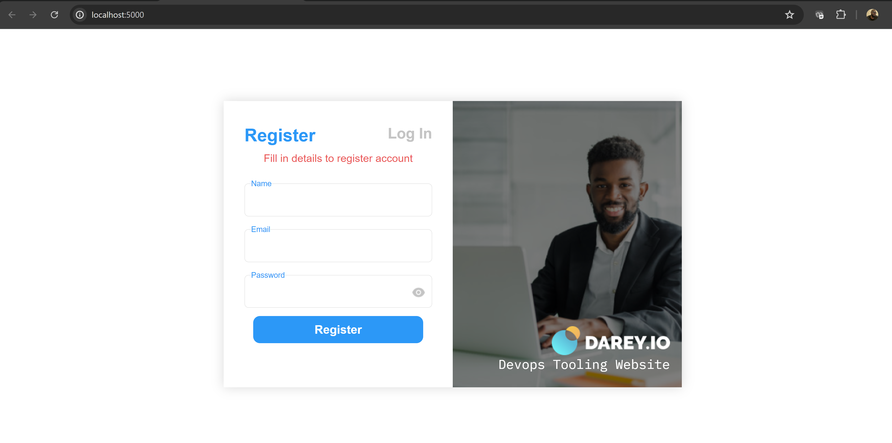

Practice Task №2 - Complete Continous Integration With A Test Stage
1.Document your understanding of all the fi elds specifi ed in the Docker Compose file tooling.yaml
2.Update your Jenkinsfile with a test stage before pushing the image to the registry.
3.What you will be testing here is to ensure that the tooling site http endpoint is able to return status code 200.Any other code will be determined a stage failure.
4.Implement a similar pipeline for the PHP-todo app.
5.Ensure that both pipelines have a clean-up stage where all the images are deleted on the Jenkins server

Here's a breakdown of the fields specified in the Docker Compose file `tooling.yaml`:


- `version: "3.9"`: Specifies the version of the Docker Compose file format.
- `services`: Defines the services that make up the application.
  - `tooling_frontend`:
    - `build: .`: Builds the Docker image for this service using the Dockerfile in the current directory.
    - `ports`: Maps port 5000 on the host to port 80 on the container.
    - `volumes`: Mounts a named volume `tooling_frontend` to `/var/www/html` in the container.
    - `links`: Links this service to the `db` service, allowing them to communicate.
  - `db`:
    - `image: mysql:5.7`: Uses the MySQL 5.7 Docker image for this service.
    - `restart: always`: Ensures the container always restarts if it stops.
    - `environment`: Sets environment variables for the MySQL container.
      - `MYSQL_DATABASE`: The name of the database required by the Tooling app.
      - `MYSQL_USER`: The MySQL user required by the Tooling app.
      - `MYSQL_PASSWORD`: The password for the MySQL user.
      - `MYSQL_RANDOM_ROOT_PASSWORD: '1'`: Generates a random root password.
    - `volumes`: Mounts a named volume `db` to `/var/lib/mysql` in the container.
- `volumes`: Defines named volumes that can be shared and reused between services.
  - `tooling_frontend`: Named volume for the `tooling_frontend` service.
  - `db`: Named volume for the `db` service

### Jenkinsfile for Tooling Application

```groovy
pipeline {
    agent any

    environment {
        DOCKER_HUB_CREDENTIALS_ID = 'Dockerhub'
        DOCKER_HUB_USERNAME = 'lourash'
        REPO_NAME = 'tooling-app'
    }

    stages {
        stage('Checkout') {
            steps {
                script {
                    git branch: 'main', url: 'https://github.com/lourash-hub/tooling-app.git'
                }
            }
        }
        stage('Build Docker Image') {
            steps {
                script {
                    def branchName = env.BRANCH_NAME
                    def version = '001' // Define your version here or dynamically obtain it

                    // Define image tag with branch prefix
                    def imageTag = "${DOCKER_HUB_USERNAME}/${REPO_NAME}:${branchName}-${version}"

                    // Build Docker image
                    sh "docker build -t ${imageTag} ."
                }
            }
        }
        stage('Test Docker Image') {
            steps {
                script {
                    def branchName = env.BRANCH_NAME
                    def version = '001'
                    def imageTag = "${DOCKER_HUB_USERNAME}/${REPO_NAME}:${branchName}-${version}"

                    // Run the container
                    sh "docker run -d --name test_container -p 5000:80 ${imageTag}"
                    
                    // Wait for a few seconds to ensure the container is up
                    sh "sleep 10"

                    // Test the HTTP endpoint to ensure it returns status code 200
                    sh """
                    STATUS_CODE=\$(curl -o /dev/null -s -w "%{http_code}" http://localhost:5000)
                    if [ "\$STATUS_CODE" -ne 200 ]; then
                        echo "HTTP endpoint returned status code \$STATUS_CODE"
                        exit 1
                    fi
                    """

                    // Clean up the test container
                    sh "docker rm -f test_container"
                }
            }
        }
        stage('Push Docker Image') {
            steps {
                script {
                    def branchName = env.BRANCH_NAME
                    def version = '001'
                    def imageTag = "${DOCKER_HUB_USERNAME}/${REPO_NAME}:${branchName}-${version}"
                    withCredentials([usernamePassword(credentialsId: env.DOCKER_HUB_CREDENTIALS_ID, passwordVariable: 'DOCKER_HUB_PASSWORD', usernameVariable: 'DOCKER_HUB_USERNAME')]) {
                        sh "echo ${DOCKER_HUB_PASSWORD} | docker login -u ${DOCKER_HUB_USERNAME} --password-stdin"
                    }
                    sh "docker push ${imageTag}"
                }
            }
        }
    }
    post {
        always {
            // Cleanup Docker environment
            sh 'docker system prune -f'
        }
    }
}
```

### Jenkinsfile for PHP-Todo Application

```groovy
pipeline {
    agent any

    environment {
        DOCKER_HUB_CREDENTIALS_ID = 'Dockerhub'
        DOCKER_HUB_USERNAME = 'lourash'
        REPO_NAME = 'php-todo'
    }

    stages {
        stage('Checkout') {
            steps {
                script {
                    git branch: 'main', url: 'https://github.com/lourash-hub/php-todo.git'
                }
            }
        }
        stage('Build Docker Image') {
            steps {
                script {
                    def branchName = env.BRANCH_NAME
                    def version = '001' // Define your version here or dynamically obtain it

                    // Define image tag with branch prefix
                    def imageTag = "${DOCKER_HUB_USERNAME}/${REPO_NAME}:${branchName}-${version}"

                    // Build Docker image
                    sh "docker build -t ${imageTag} ."
                }
            }
        }
        stage('Test Docker Image') {
            steps {
                script {
                    def branchName = env.BRANCH_NAME
                    def version = '001'
                    def imageTag = "${DOCKER_HUB_USERNAME}/${REPO_NAME}:${branchName}-${version}"

                    // Run the container
                    sh "docker run -d --name test_container -p 5000:80 ${imageTag}"
                    
                    // Wait for a few seconds to ensure the container is up
                    sh "sleep 10"

                    // Test the HTTP endpoint to ensure it returns status code 200
                    sh """
                    STATUS_CODE=\$(curl -o /dev/null -s -w "%{http_code}" http://localhost:5000)
                    if [ "\$STATUS_CODE" -ne 200 ]; then
                        echo "HTTP endpoint returned status code \$STATUS_CODE"
                        exit 1
                    fi
                    """

                    // Clean up the test container
                    sh "docker rm -f test_container"
                }
            }
        }
        stage('Push Docker Image') {
            steps {
                script {
                    def branchName = env.BRANCH_NAME
                    def version = '001'
                    def imageTag = "${DOCKER_HUB_USERNAME}/${REPO_NAME}:${branchName}-${version}"
                    withCredentials([usernamePassword(credentialsId: env.DOCKER_HUB_CREDENTIALS_ID, passwordVariable: 'DOCKER_HUB_PASSWORD', usernameVariable: 'DOCKER_HUB_USERNAME')]) {
                        sh "echo ${DOCKER_HUB_PASSWORD} | docker login -u ${DOCKER_HUB_USERNAME} --password-stdin"
                    }
                    sh "docker push ${imageTag}"
                }
            }
        }
    }
    post {
        always {
            // Cleanup Docker environment
            sh 'docker system prune -f'
        }
    }
}
```


- **Test Docker Image Stage**: Both Jenkinsfiles have a test stage that runs the built Docker image as a container and checks if the HTTP endpoint returns a status code 200. If the status code is not 200, the build fails.
  - **Run the Container**: Starts the container in detached mode.
  - **Wait for the Container**: Waits for a few seconds to ensure the container is fully up and running.
  - **Test the Endpoint**: Uses `curl` to check if the endpoint returns status code 200.
  - **Clean Up**: Removes the test container after testing.

- **Post Section**: The `post` section always runs a Docker system prune command to clean up the Docker environment, removing unused containers, networks, images, and optionally, volumes.

### Steps to Implement the Jenkins Pipelines

1. **Create the Jenkinsfiles**:
   - Create separate `Jenkinsfile`s for the Tooling and PHP-Todo applications with the content provided above.

2. **Connect Your Repos to Jenkins**:
   - In your Jenkins dashboard, create new items (multibranch pipelines) for both the Tooling and PHP-Todo applications.
   - Configure the GitHub repository URLs and add credentials if necessary.

3. **Create Multi-Branch Pipelines**:
   - Jenkins will automatically detect branches with a `Jenkinsfile` and create corresponding jobs.

4. **Simulate CI Pipeline**:
   - Make changes to both the feature and master branches to trigger builds.
   - Ensure the tagged images from the `Jenkinsfile` have a prefix indicating the branch.

5. **Verify Pushed Images**:
   - Check the Docker Hub repository to verify that the images have been pushed correctly with the appropriate tags.

6. **Clean-Up Stage**:
   - The `post` section always runs a Docker system prune command to clean up the Docker environment, removing unused containers, networks, images, and optionally, volumes.


   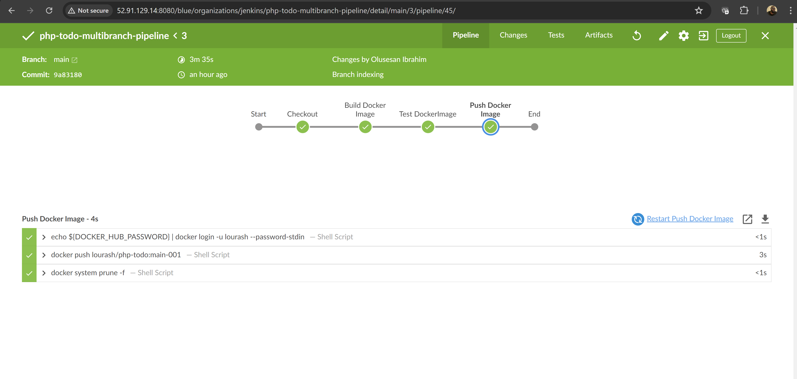